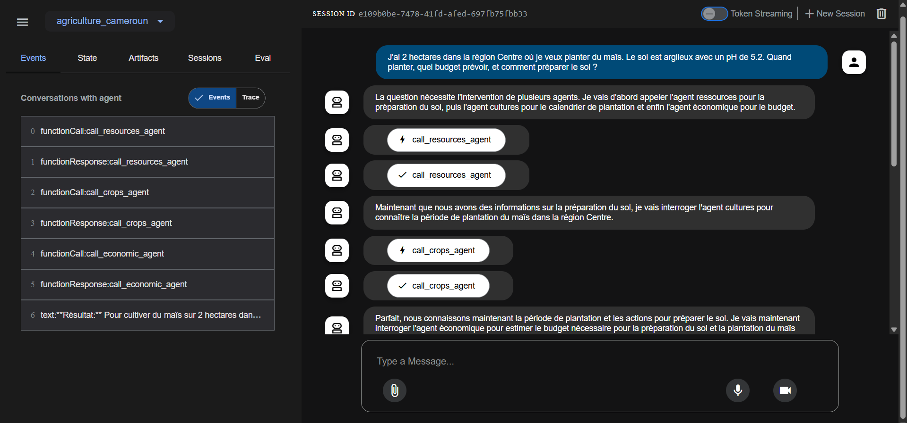
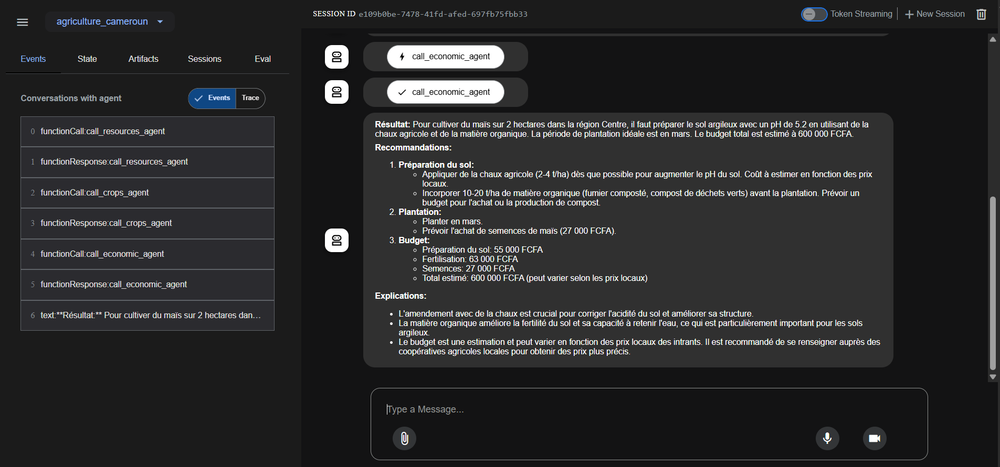
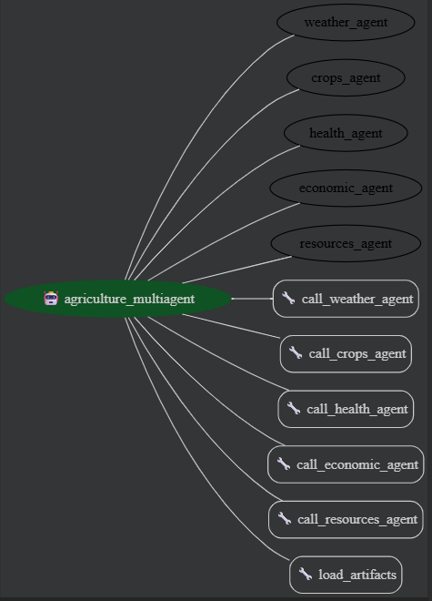
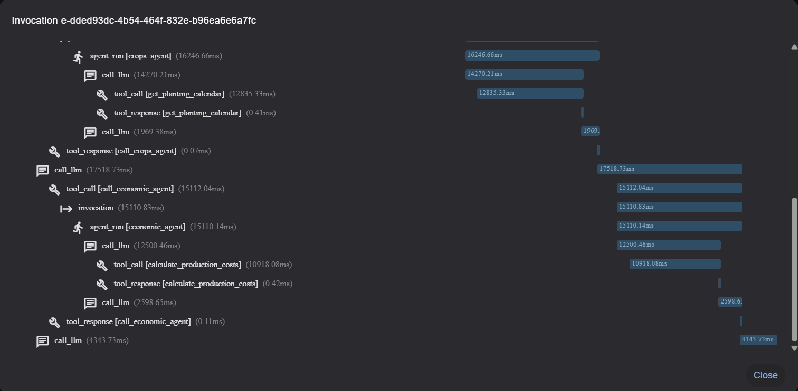

# 🌱 Agriculture Cameroun - Système Multi-Agents

[](https://python.org)
[](https://python-poetry.org/)

Un système intelligent multi-agents basé sur l'Agent Development Kit (ADK) de Google, spécialement conçu pour révolutionner l'agriculture camerounaise en fournissant des conseils personnalisés et des solutions adaptées aux défis locaux.




## 👨‍💻 Auteur

**Mbassi Loic Aron**

- 📧 Email: [balaandeguefrancoislionnel@gmail.com](mailto:balaandeguefrancoislionnel@gmail.com)
- 🌐 Portfolio: [francoislionnel.tech](http://francoislionnel.tech/)
- 🐙 GitHub: [@BalaAndegue](https://github.com/BalaAndegue)

## 🎯 Objectif

Démocratiser l'accès aux technologies agricoles modernes pour les agriculteurs camerounais, en combinant l'intelligence artificielle avec l'expertise locale pour améliorer les rendements, réduire les pertes et optimiser la rentabilité.


## Fonctionnalités Principales

### 🌤️ Agent Météorologique

- Prévisions météorologiques localisées
- Alertes climatiques en temps réel
- Conseils d'adaptation aux conditions météo
- Calendrier optimal des activités agricoles

### 🌾 Agent Cultures

- Calendriers de plantation personnalisés
- Techniques culturales adaptées
- Sélection de variétés résistantes
- Rotation des cultures et associations

### 🔬 Agent Santé des Plantes

- Diagnostic automatique des maladies
- Identification des ravageurs
- Recommandations de traitement bio et chimique
- Stratégies de prévention

### 💰 Agent Économique

- Analyse des prix de marché
- Calcul de rentabilité
- Stratégies de commercialisation
- Optimisation des coûts de production

### 🌍 Agent Ressources

- Gestion optimale du sol
- Conseils en irrigation
- Recommandations d'engrais locaux
- Techniques de conservation
- 
- 

### Appercue de la trace



## 🚀 Guide d'Installation

## 🚀 Installation

### ⚡ Installation Express (5 minutes)

```bash
# Installation automatique (Linux/macOS)
curl -sSL https://raw.githubusercontent.com/Nameless0l/agriculture-cameroun/main/setup.sh | bash

# Ou sur Windows (PowerShell Admin)
iex ((New-Object System.Net.WebClient).DownloadString('https://raw.githubusercontent.com/BalaAndegue/agriculture-cameroun/main/setup.ps1'))
```

### 📚 Guides Détaillés

- **[🚀 Démarrage Rapide](QUICKSTART.md)** - Commencer en 5 minutes
- **[📦 Installation Complète](INSTALLATION.md)** - Guide détaillé pas à pas
- **[⚙️ Configuration Avancée](docs/configuration.md)** - Personnalisation

### Prérequis Système

- **Python** : Version 3.12 ou supérieure
- **Poetry** : Gestionnaire de dépendances moderne
- **Git** : Pour le contrôle de version
- **Clé API Google Gemini** : Pour l'intelligence artificielle

### Configuration

1. **Cloner le projet**

```bash
git clone https://github.com/BalaAndegue/agriculture-cameroun.git agriculture
cd agriculture
```

2. **Installer les dépendances**

```bash
poetry install
```

3. **Configurer les variables d'environnement**

```bash
cp .env.example .env
# Éditer le fichier .env avec vos clés API
```

4. **Variables d'environnement requises**

```bash
# Obligatoire
GEMINI_API_KEY=your_gemini_api_key_here

# Optionnel
DEFAULT_REGION=Centre
DEFAULT_LANGUAGE=fr
```

## 🔧 Utilisation

### Lancer l'interface web

```bash
poetry shell
adk web
```

Puis ouvrir `http://localhost:8000` dans votre navigateur.

### Lancer en mode CLI

```bash
poetry shell
adk run .
```

### Exemples de questions

- "Quand planter le maïs dans la région Centre ?"
- "Mon cacao a des taches brunes, que faire ?"
- "Quel est le prix actuel de l'arachide ?"
- "Comment améliorer la fertilité de mon sol ?"
- "Quelles sont les prévisions météo pour cette semaine ?"

## 🏗️ Architecture

```
agriculture/
├── agent.py              # Agent principal coordinateur
├── prompts.py            # Instructions pour l'agent principal
├── tools.py              # Outils de communication inter-agents
├── sub_agents/           # Agents spécialisés
│   ├── weather/          # Agent météorologique
│   ├── crops/            # Agent de gestion des cultures
│   ├── health/           # Agent santé des plantes
│   ├── economic/         # Agent économique
    ├── resources/              # Configuration et modèles de données
│   └──        # Agent de gestion des ressources
└── utils/
    ├── data.py           # Données agricoles camerounaises
    └── utils.py          # Fonctions utilitaires
```

## 🌍 Données Locales

Le système intègre des données spécifiques au Cameroun :

### Régions supportées

- Centre, Littoral, Ouest, Sud, Est
- Nord, Adamaoua, Extrême-Nord
- Nord-Ouest, Sud-Ouest

### Cultures principales

- Cacao, Café, Manioc, Maïs
- Plantain, Arachide, Igname
- Coton, Palmier à huile

### Fonctionnalités locales

- Calendriers de plantation par région
- Prix de marché en FCFA
- Maladies communes au Cameroun
- Techniques traditionnelles efficaces
- Engrais et ressources locaux

## 🧪 Tests

Exécuter les tests :

```bash
poetry run pytest tests/ -v
```

Tests avec couverture :

```bash
poetry run pytest tests/ --cov=agriculture --cov-report=html
```

## 📊 Évaluation

Le système inclut des tests d'évaluation :

```bash
adk eval . eval/agriculture_eval_set.json
```

## 🔌 Intégration API

Le système peut être utilisé via API REST :

```python
import requests

response = requests.post("http://localhost:8000/", json={
    "message": "Comment traiter la pourriture brune du cacao ?",
    "session_id": "unique_session_id"
})
```

## 🛠️ Configuration Avancée

### Personnalisation des modèles

Modifier les modèles utilisés dans `.env` :

```bash
ROOT_AGENT_MODEL=gemini-2.0-flash-001
WEATHER_AGENT_MODEL=gemini-2.0-flash-001
# etc.
```

### Ajout de nouvelles cultures

1. Modifier `agriculture/config.py` pour ajouter le type de culture
2. Mettre à jour `agriculture/utils/data.py` avec les données
3. Adapter les prompts des agents si nécessaire

### Extension des régions

1. Ajouter la région dans `RegionType` (`config.py`)
2. Compléter les données dans `REGIONS` (`utils/data.py`)
3. Mettre à jour les mapping culture-région

## 🤝 Contribution

1. Fork le projet
2. Créer une branche feature (`git checkout -b feature/nouvelle-fonctionnalite`)
3. Commiter les changements (`git commit -m 'Ajouter nouvelle fonctionnalité'`)
4. Push vers la branche (`git push origin feature/nouvelle-fonctionnalite`)
5. Ouvrir une Pull Request

## 📝 License

Ce projet est sous licence Apache 2.0. Voir le fichier `LICENSE` pour plus de détails.

## 🆘 Support

Pour toute question ou problème :

1. Vérifier la [documentation ADK](https://docs.anthropic.com)
2. Consulter les issues existantes
3. Créer une nouvelle issue avec les détails du problème

## 📈 Roadmap

- [ ] Interface mobile responsive
- [ ] Intégration données météo en temps réel
- [ ] Module de recommandations personnalisées
- [ ] Système de notifications par SMS
- [ ] Extension vers d'autres pays d'Afrique centrale
- [ ] Intégration avec les coopératives agricoles
- [ ] Module de formation et tutoriels vidéo

## 🔍 Exemple d'utilisation complète

```python
# Exemple d'utilisation programmatique
from agriculture import root_agent
from agriculture.config import AgricultureConfig

# Configuration
config = AgricultureConfig(
    default_region="Centre",
    default_language="fr"
)

# Question complexe multi-agents
question = """
J'ai 2 hectares dans la région Centre où je veux planter du maïs. 
Le sol est argileux avec un pH de 5.2. 
Quand planter, quel budget prévoir, et comment préparer le sol ?
"""

# Le système va automatiquement :
# 1. Consulter l'agent météo pour le timing optimal
# 2. Consulter l'agent cultures pour le calendrier de plantation
# 3. Consulter l'agent ressources pour l'amélioration du sol
# 4. Consulter l'agent économique pour le budget
# 5. Synthétiser toutes les recommandations
```

## 🌟 Fonctionnalités Avancées

### Multi-Agent Orchestration

Le système coordonne automatiquement les agents pour des réponses complètes :

- Analyse contextuelle intelligente
- Synthèse des recommandations multi-sources
- Gestion des contradictions entre agents
- Priorisation des conseils selon l'urgence

### Adaptation Culturelle

- Intégration des pratiques traditionnelles efficaces
- Respect des contraintes économiques locales
- Prise en compte des ressources disponibles
- Conseils adaptés aux petites exploitations

### Intelligence Économique

- Analyse temps réel des prix de marché
- Calculs de rentabilité personnalisés
- Identification d'opportunités commerciales
- Optimisation des coûts de production
